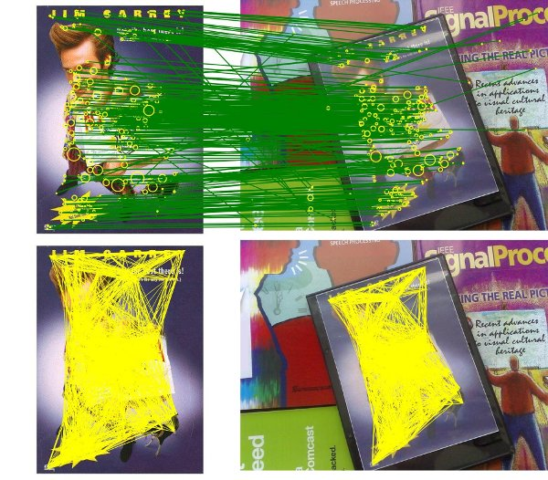

# matching


## Nearest neighbor search

We provide a generic interface to perform:

* **Nearest neighbor search (NNS)**
* **K-Nearest Neighbor (K-NN)**

Three implementations are available:

* a Brute force,
* an Approximate Nearest Neighbor [FLANN],
* a Cascade hashing Nearest Neighbor [CASCADEHASHING].

This module works for data of any dimensionality, it could be use to match:

* 2 or 3 vector long features (points),
* 128, 64, vector long features (like global/local feature descriptors).

Using the **Nearest neighbor search (NNS)** let you find pairs of elements (``(i,j)``) from sets ``A`` and ``B`` that are the closest for a given metric ``d``:

$$
\lbrace (P^i_A,P^j_B): j = \underset{k} {\mathrm{argmin}} \quad d(\text{desc}(P^i_A), \text{desc}(P^k_B)) \rbrace
$$
  
Using the **K-NN** will return you tuple of elements: ``(i;(j,k))`` if 2 nearest values have been asked for the Inth query.

Example of usage:

```
// Setup the matcher 
ArrayMatcherBruteForce<float> matcher;
// The reference array
float array[] = {0, 1, 2, 3, 4};
// Setup the reference array of the matcher 
matcher.Build(array, 5, 1);

//--
// Looking for the nearest neighbor:
//--
// Perform a query to look which point is closest to 1.8
float query[] = {1.8f};
int nIndice = -1;
float fDistance = -1.0f;
matcher.SearchNeighbour(query, &nIndice, &fDistance);

//  nIndice == 2 ; // index of the found nearest neighbor
//  fDistance == 0.4; // squared distance

//--
// Looking for the K=2 nearest neighbor
//--
IndMatches vec_nIndices;
vector<float> vec_fDistance;
const int K = 2;
matcher.SearchNeighbours(query, 1, &vec_nIndices, &vec_fDistance, K);

// vec_nIndices = {IndMatch(0,2), IndMatche(0,1)};
```


## Metric customization

* L2 (used by default):
* L1 for binary descriptor (Hamming distance),
* user customized distance.


## Image domain, correspondences filtering (KVLD)

When used with descriptors found putative matches can be filtered thanks to different filters:

* Symmetric distance (Left-Right check).

  * Keep only mutal correspondences: a match is kept if it is the same in the A->B and B->A order.
    
$$
\lbrace (P^i_A,P^j_B): j = \underset{k} {\mathrm{argmin}} ~ d(\text{desc}(P^i_A), \text{desc}(P^k_B)), i = \underset{k} \min ~ d(\text{desc}(P^k_A), \text{desc}(P^j_B))
\rbrace
$$


* "Nearest Neighbor Distance Ratio" distance check can be performed to remove repetitive elements.

  * As many nearest points have been asked we can measure the similarity between the N-nearest neighbor. If the ratio of distance is inferior to a threshold ``\delta`` the match is kept else it is rejected (since the risk of confusion is higher). It allows to avoid ambiguous correspondences. ``\delta`` is often chosen between ``0.6`` and ``0.8``.
    
$$
\lbrace (P^i_A,P^j_B): j = \underset{k} {\mathrm{argmin}} ~ d(\text{desc}(P^i_A), \text{desc}(P^k_B)) < \delta \underset{k\neq j} \min ~ d(\text{desc}(P^i_A), \text{desc}(P^k_B))
\rbrace
$$

* K-VLD Filter (K-Virtual Line Descriptor) [KVLD12]

  * A virtual segment (a segment/line between two points) is kept if at least one of it's supporting point is linked to K virtual segments. It produces a coherent photometric graph of the features from the set of points ``A`` and ``B``. Below: Top (SIFT putative matches found by NNS), Bottom: K-VLD coherent matches.
  


