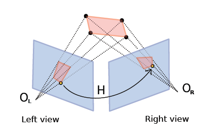
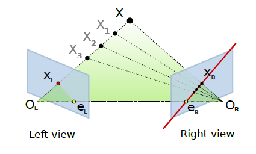
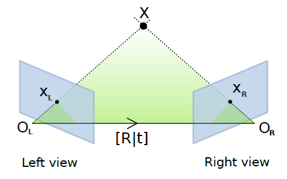
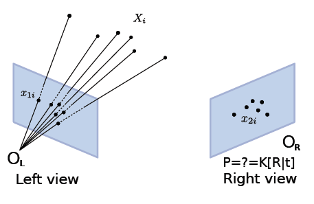
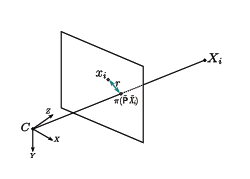
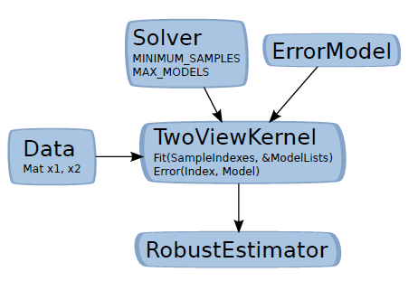

# multiview

The multiview module consists of:

- a collection of solvers for 2 to n-view geometry constraints that arise in multiple view geometry,
- a generic framework "Kernel" that can embed these solvers for robust estimation.

First accessible solvers are listed and explained and the "Kernel" concept is documented.

## 2-view solvers (2d-2d correspondences)

This project provides solver for the following geometric estimation:

* affine,
* homographic,
* fundamental,

  * 7 to n pt,
  * 8 to n pt (Direct Linear Transform) [HZ].
  
* essential,

  * 8 to n pt (Direct Linear Transform) [HZ],
  * 5pt + intrinsic [Stewenius], [Nister].

## N-View geometry estimation

* Triangulation

  * 2 to n view (Direct Linear Transform),
  * 2 to n view (Iterated least square).
  
* Rotation averaging

  * L2 (sparse) [Martinec],
  * L1 (sparse) [Chatterjee].

* Translation averaging

  * L2 Chordal [Kyle2014],
  * SoftL1 'approximation of the LInf method of [GlobalACSfM]'.

### Homography matrix:

The homography matrix maps the relation between two projections of a plane.

`H` is a (3 x 3) matrix that links coordinates in left and right images with the following relation.

This project implementation follows the DLT (Direct Linear Transform) explained in [HZ] book:
`H` can be estimated from 4 to `n` corresponding points.

### Fundamental matrix:

The fundamental matrix is a relation between two images viewing the same scene where those point's
projections are visible in the two images. Given a point correspondence between two views $`(x_i,x'_i)`$:

We obtain the following relation:

$$
x'^T_i Fx_i = 0
$$

`F` is the (3 x 3) Fundamental matrix, it puts in relation a point x to a line where belong the projection of the 3D X point.
$`l'_i = Fx_i`$ designs the epipolar line on which the point $`x'_i`$ could be.
The relation $`x'^T_i Fx_i = 0`$ exists for all corresponding point belonging to a stereo pair.

The fundamental matrix is sometime called bifocal-tensor, it is a 3 x 3 matrix of rank 2
with 7 degree of freedom. 8 ou 7 correspondences are sufficient to compute the `F` matrix.
Implementation follows the DLT (Direct Linear Transform) explained in [HZ] book.

## Relative pose estimation (Essential matrix)

Adding intrinsic parameters to the fundamental matrix gives a metric "object" that provides the following relation
`E = K'^T FK` , this is the Essential relation explained by Longuet-Higgins in 1981 [Longuet].
This essential matrix links the relative position of the camera to the fundamental matrix relation.

## Absolute pose estimation/Camera resection (Pose matrix)

Given a list of 3D-2D point correspondences it is possible to compute a camera pose estimation.
It consists in estimating the camera parameters of the right camera that minimizes the residual error of the 3D points re-projections, it's an optimization problem that trying to solve P parameters in order to minimize 

$$
min \sum^n_{i=1} x_i - P(X_i).
$$

This project provides 3 different solvers for this problem:

* 6pt Direct Linear Transform [HZ],
* 4pt with intrinsic EPnP [EPnP],  
* 3pt with intrinsic P3P [Kneip].

### Kernel concept

In order to use the solver in a generic robust estimation framework, we use them in conjuction with the Kernel class that allow to link:

* data points,

  * the set of correspondences that are used for a robust estimation problem.

* a model solver/estimator,
* a metric to measure data fitting to a putative model.

Solver:
	MINIMUM_SAMPLES: The minimal number of point required for the model estimation,
	MAX_MODELS: The number of models that the minimal solver could return,
	A Solve function that estimates a model from MINIMUM_SAMPLES to n vector data.
ErrorModel: 
	A metric function that returns the error of a sample data to the provided model.
Kernel: 
	Embed data (putative), the model estimator and the error model.
	This kernel is core brick used in the This project robust estimator framework.

